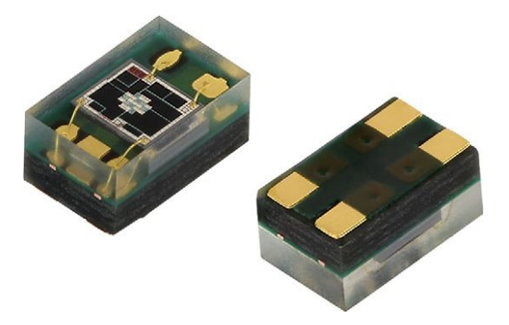
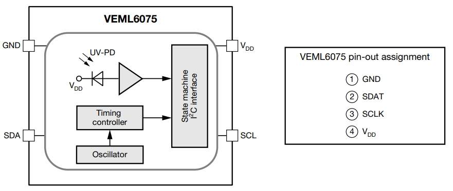
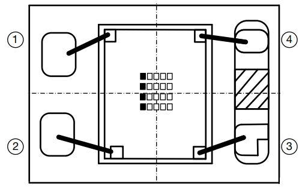
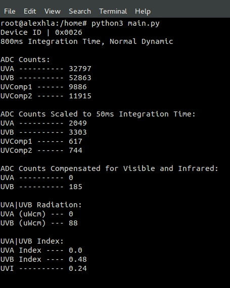
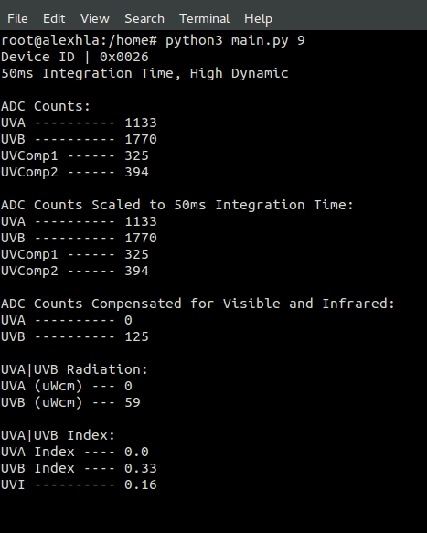

# uva-uvb-sensor-veml6075-driver
Driver for Vishay Semiconductor VEML6075 UVA and UVB Light Sensor with I2C Interface

	
	
	

##### Download Source Files
$ curl -LO https://github.com/alexhla/uva-uvb-sensor-veml6075-driver/archive/master.zip
##### Unzip
$ unzip master.zip
##### Navigate to Project
$ cd uva-uvb-sensor-veml6075-driver-master
##### Read Sensor
$ python3 main.py

##### Read UVA|UVB with Default Sensitivity

	

##### Read UVA|UVB with Specified Sensitivity (0-9), where 0 is most, 9 is least sensitive

	

